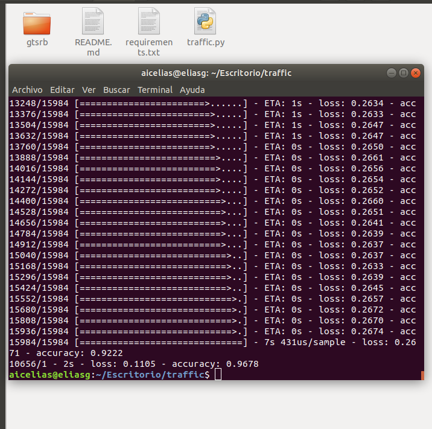

# jibsamGarcia
# traffic
The convolutional neural network model is based on the TensorFlow Keras sequential model.

I started by applying: a convolutional layer with 32 filters and a 3x3 kernel, a maximum grouping layer with a 2x2 grouping size, a hidden layer with 128 units and a dropout of 0.5. The results showed that it was insufficient to learn the data set. This reason was probably that a convolutional layer and a grouping layer did not generalize the image enough, Also, only one hidden one was certainly insufficient for such a complex data set.

Then add one more hidden layers with 128 units and the same reluctance. The results were much better, but there was still a lot of room for improvement. Having more layers made the model train better.

Actually it seems that having another layer of grouping after the second convolutional layer helps reduce loss and preserves precision, but I decided last to leave only one layer.

Download Dataset gtsrb clic here: https://drive.google.com/file/d/1aosWzt0l3TNeiZm3hTtlYueoewpc66er/view?usp=sharing

# Usage
Require Python(3) to run:

  $ python3 traffic.py gtsrb 
  
Clic image for the watch video. 

